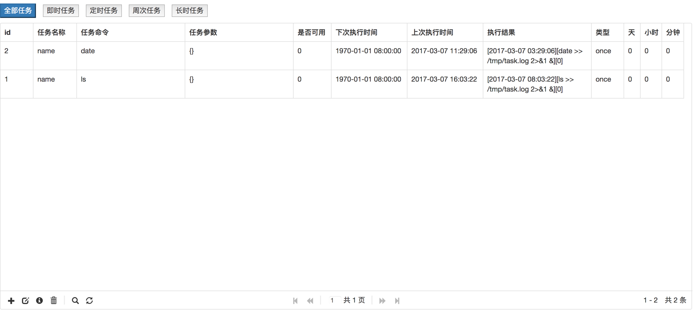

# PHP异步任务队列管理器asyntask
asyntask是一个轻量级异步任务队列管理器，支持实时，定时，长时和周期任务。
# 安装
## 下载源码

直接使用：

git clone https://github.com/spetacular/asyntask.git
命令下载到本地。

也可以点击 https://github.com/spetacular/asyntask/archive/master.zip 下载最新内容的压缩包，然后解压。
## 通过 composer 来安装

   在你的 composer 项目中的 composer.json 文件中，添加这部分：
```
   {
       "require": {
           "davidyan/asyntask": ">=1.0"
       }
   }
```
   就可以了。

# 配置
1.asyntask的数据默认存储在Mysql数据库里，因此需要更改config.php里的配置：

```
	'DB_HOST'=>'127.0.0.1',
	'DB_NAME' => 'asyntask',
	'DB_USER' => 'root',
	'DB_PWD' => '',
	'DB_PORT' => '3306',
	'DB_CHARSET' => 'utf8mb4',
```

2.导入数据表
将resource文件夹里的db.sql导入数据库中。

3.配置健康检查脚本
run.sh定期检查异步任务的运行状况，如果挂了，cron_asyn_task.php脚本。
```
chmod +x run.sh
```
然后配置CronTab。运行`crontab -e`，然后添加一行：
```
* * * * * root  path-to/run.sh  > /dev/null 2>&1
```
# 使用方式
##管理后台
自带管理后台，可以轻松添加、编辑、删除、搜索任务。代码在resource/asynadmin里，请自行部署。
[](./resource/asynadmin.jpeg)
##编程方式
可以集成到项目中。

# asyntask
A lightweight asynchronous queue manager, supporting real-time, timing, long-term, periodic tasks.
